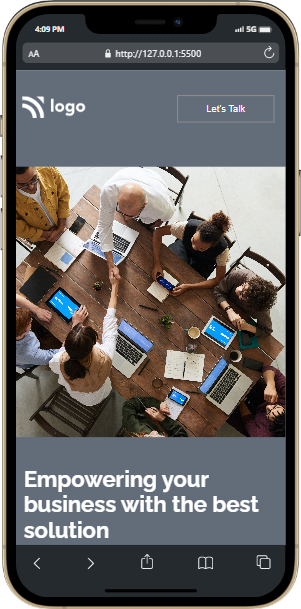
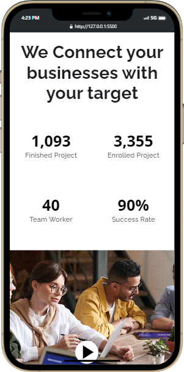
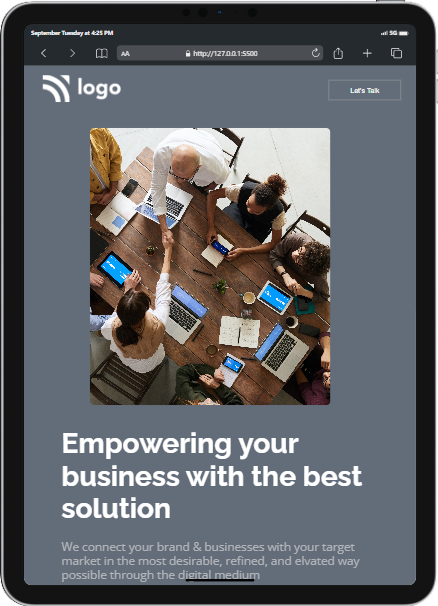
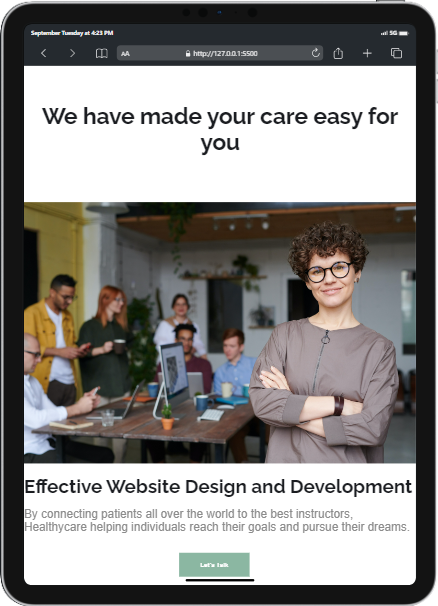
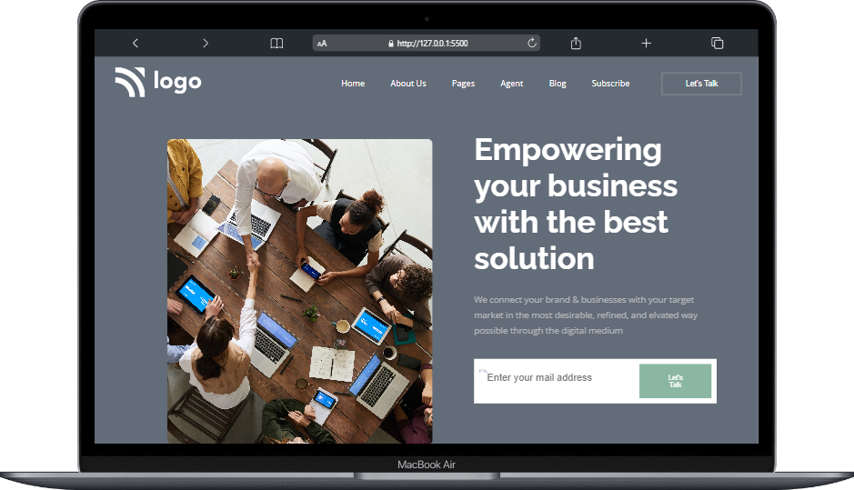
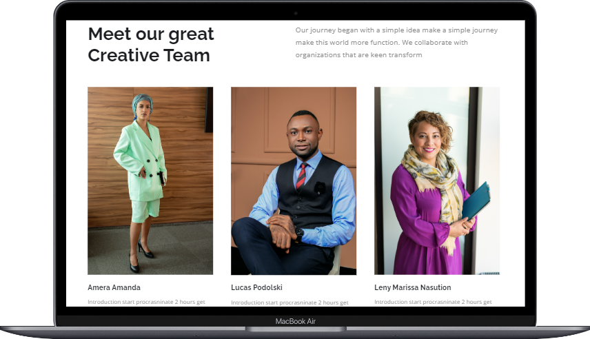

# Business Landing Page

***
## Description

This project [Business Landing Page](https://businesss-homepage.netlify.app/) was built using Semantic HTML and CSS from scratch. The main aim was to make the webpage based on the design provided and also make it responsive for all major devices. This project helped me in learning brushing up concepts like **grid**, **transform**, **make mega-menu footer**, **pseudo classes :nth-child** and etc. The Project was completed under guidance of [Hitesh Choudhary](https://github.com/hiteshchoudhary), CTO Ineuron

***

### Links for Project

* [LIVE Project Link](https://businesss-homepage.netlify.app/)

* [Youtube Video Demo](https://youtu.be/Nto_1rFGHGc)

* [Source Code](https://github.com/ShubhamSingh03/Business-Landing-Page)

***
### Built With 

* Semantic HTML
* Custom CSS classes
* FlexBox
* Grid
* Positions
* Media Queries
* Pseudo elements & classes

***

### Key Learnings

* Learned using [grid](https://developer.mozilla.org/en-US/docs/Web/CSS/CSS_Grid_Layout)
* Learned Using Grid for responsive designs as well as to create team member cards. 
* Learned to create mega-menu footer
* Learned to use [transform](https://developer.mozilla.org/en-US/docs/Web/CSS/transform) property on navbar & footer items.
* Learned using [flexbox](https://developer.mozilla.org/en-US/docs/Web/CSS/flex)
* Learned to handle various sections inside the same container.
* Learned to make webpage responsive with the help of [media queries](https://developer.mozilla.org/en-US/docs/Web/CSS/Media_Queries/Using_media_queries)

***

### Time Taken to finish this project
 

>6 hours to build it from scratch.

>4 hours to make it responsive

 

***

### Screencaptures of Project

 

  1. #### Whole Webpage(Large screens)

   

  

   

  2. #### Mobile View

 

 

  3. #### Tablet View 

   

  

   

  

   

   

  4. #### Large Screen View 

   

  

   
  
  

   

***

### Checkout Portfolio & Other Projects
 

#### [Personal Portfolio](https://shubhambhoj.in/)

#### [Findcoder Profile](https://www.findcoder.io/u/shubham_singh)
***

### Connect with Me
* [Mailto](mailto:shubhambhoj3@gmail.com)
* [LinkedIn](https://www.linkedin.com/in/shubham-singh-b122b7171/)
* [Github](https://github.com/ShubhamSingh03)
* [Findcoder](https://www.findcoder.io/u/shubham_singh)
***
***
[go to top](#business-landing-page)